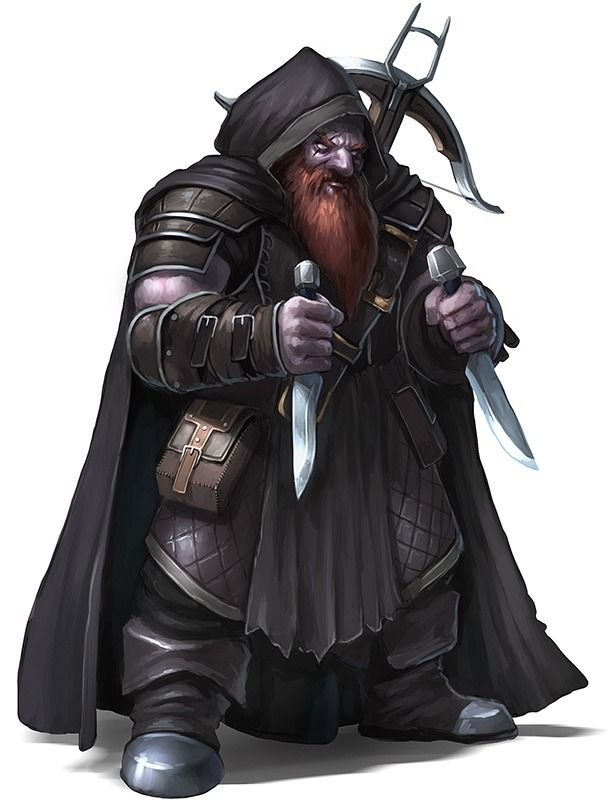

Glimmik grew up in the streets of Osgan with his “brothers”...a bunch of misfits who ran away from their orphanages.  Over the years Glimmik and his brothers convinced others to join them and leave their homes.  They have become to be known as “The Family”.  

The Family now runs as a group of mercenaries willing to do unsavory tasks for those interested in paying enough.  The Family has much influence with many polititions in governments, but their influence isn’t focused around gaining power, its used to help get those caught out of jail.

The Family isn’t an evil organization, and they have limits as to what they will do.  Murder isn’t off the table, but the price is insanely high.  The Family’s typical jobs fall into smuggling, theft, and kidnapping.  

Glimmik befrended Edwin and Anastasia during their time in Osgan.  They continue to stay in touch to this day.
